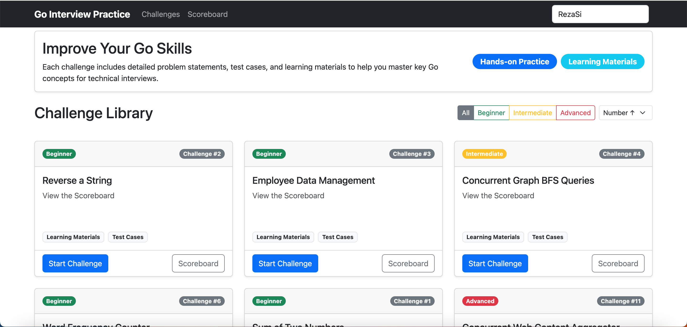

# Go Interview Practice 🚀

Welcome to the **Go Interview Practice** repository! Master Go programming and ace your technical interviews with our interactive coding challenges.

---

## 🎨 **Visual Overview**

### 📋 Interactive Challenge Platform
Our comprehensive web interface provides everything you need to practice and master Go programming:

<div align="center">
  
  <p><em>📊 Complete challenge dashboard with difficulty levels, progress tracking, and performance metrics</em></p>
</div>

---

### 💻 **Code & Test Experience**

<div align="center">
  
  
</div>

<div align="center">
  <table>
    <tr>
      <td align="center" width="48%">
        <strong>🔧 Interactive Code Editor</strong><br>
        <em>Write, edit, and test your Go solutions<br>with syntax highlighting and real-time feedback</em>
      </td>
      <td width="4%"></td>
      <td align="center" width="48%">
        <strong>📈 Instant Results & Analytics</strong><br>
        <em>Get immediate test results, performance metrics,<br>and detailed execution analysis</em>
      </td>
    </tr>
  </table>
</div>

---

### 🏆 **Competitive Leaderboard**

<div align="center">
  
  <p><em>🏅 Beautiful leaderboard showcasing top developers with challenge completion indicators, rankings, and achievements</em></p>
</div>

---

## 🏆 **Top 10 Leaderboard**

Our most accomplished Go developers, ranked by number of challenges completed:

> 📝 **Note**: The data below is automatically updated by GitHub Actions when challenge scoreboards change.

| 🏅 | Developer | Solved | Rate | Achievement | Progress |
|:---:|:---:|:---:|:---:|:---:|:---|
| 🥇 | <br/>**[RezaSi](https://github.com/RezaSi)** | **14**/28 | **50.0%** | 💪 Advanced | ✅✅✅✅✅✅⬜⬜⬜✅⬜⬜✅⬜<br/>⬜⬜✅✅✅⬜✅✅✅⬜⬜⬜⬜⬜ |
| 🥈 | <br/>**[AliNazariii](https://github.com/AliNazariii)** | **4**/28 | **14.3%** | 🌱 Beginner | ✅✅✅✅⬜⬜⬜⬜⬜⬜⬜⬜⬜⬜<br/>⬜⬜⬜⬜⬜⬜⬜⬜⬜⬜⬜⬜⬜⬜ |
| 🥉 | <br/>**[setarehabhari](https://github.com/setarehabhari)** | **1**/28 | **3.6%** | 🌱 Beginner | ✅⬜⬜⬜⬜⬜⬜⬜⬜⬜⬜⬜⬜⬜<br/>⬜⬜⬜⬜⬜⬜⬜⬜⬜⬜⬜⬜⬜⬜ |

<div align="center">

✅ Completed • ⬜ Not Completed

*All 28 challenges shown in two rows*

</div>

*Updated automatically based on 28 available challenges*

### 🎯 **Challenge Progress Overview**

- **Total Challenges Available**: 28
- **Active Developers**: 3
- **Most Challenges Solved**: 14 by RezaSi

---

## 🌟 Key Features

- **Interactive Web UI** - Code, test, and submit solutions in your browser
- **Automated Testing** - Get immediate feedback on your solutions
- **Automated Scoreboards** - Solutions are automatically scored and ranked
- **Performance Analytics** - Track execution time and memory usage for your solutions
- **Comprehensive Learning** - Each challenge includes detailed explanations and resources
- **Progressive Difficulty** - From beginner to advanced Go concepts

## 🚀 Quick Start

> ⚠️ **Important**: You must fork this repository first before cloning, otherwise you won't be able to push your solutions or create pull requests!

### Option 1: Web UI (Recommended)

```bash
# 1. First, fork this repository on GitHub
#    Go to https://github.com/RezaSi/go-interview-practice
#    Click the "Fork" button in the top-right corner

# 2. Clone your forked repository (replace 'yourusername' with your GitHub username)
git clone https://github.com/yourusername/go-interview-practice.git
cd go-interview-practice

# 3. Start the web interface
cd web-ui
go run main.go

# 4. Open http://localhost:8080 in your browser
```

**After solving challenges and submitting solutions:**
- Your solutions will be automatically saved to your local repository
- Follow the provided Git commands to commit and push your changes
- Create a pull request to contribute your solutions back to the main project

### Option 2: Command Line

```bash
# 1. Fork the repository first (see step 1 above)
# 2. Clone your fork and set up a challenge workspace
git clone https://github.com/yourusername/go-interview-practice.git
cd go-interview-practice
./create_submission.sh 1  # For challenge #1

# 3. Implement your solution in the editor of your choice

# 4. Run tests
cd challenge-1
./run_tests.sh
```

## 📊 Scoreboards

Each challenge has its own scoreboard that tracks:
- Successful submissions by user
- Execution time rankings
- Code efficiency metrics
- Completion dates

View global and per-challenge scoreboards in the Web UI to compare your solutions with others.

## 📚 Challenge Categories

### 🟢 Beginner
Perfect for those new to Go or brushing up on fundamentals
- **[Challenge 1](./challenge-1)**: Sum of Two Numbers
- **[Challenge 2](./challenge-2)**: Reverse a String
- **[Challenge 3](./challenge-3)**: Employee Data Management
- **[Challenge 6](./challenge-6)**: Word Frequency Counter
- **[Challenge 18](./challenge-18)**: Temperature Converter
- **[Challenge 21](./challenge-21)**: Binary Search Implementation
- **[Challenge 22](./challenge-22)**: Greedy Coin Change

### 🟠 Intermediate
For developers familiar with Go who want to deepen their knowledge
- **[Challenge 4](./challenge-4)**: Concurrent Graph BFS Queries
- **[Challenge 5](./challenge-5)**: HTTP Authentication Middleware
- **[Challenge 7](./challenge-7)**: Bank Account with Error Handling
- **[Challenge 10](./challenge-10)**: Polymorphic Shape Calculator
- **[Challenge 13](./challenge-13)**: SQL Database Operations
- **[Challenge 14](./challenge-14)**: Microservices with gRPC
- **[Challenge 16](./challenge-16)**: Performance Optimization
- **[Challenge 17](./challenge-17)**: Interactive Debugging Tutorial
- **[Challenge 19](./challenge-19)**: Slice Operations
- **[Challenge 20](./challenge-20)**: Circuit Breaker Pattern
- **[Challenge 23](./challenge-23)**: String Pattern Matching
- **[Challenge 27](./challenge-27)**: Go Generics Data Structures

### 🔴 Advanced
Challenging problems that test mastery of Go and computer science concepts
- **[Challenge 8](./challenge-8)**: Chat Server with Channels
- **[Challenge 9](./challenge-9)**: RESTful Book Management API
- **[Challenge 11](./challenge-11)**: Concurrent Web Content Aggregator
- **[Challenge 12](./challenge-12)**: File Processing Pipeline
- **[Challenge 15](./challenge-15)**: OAuth2 Authentication
- **[Challenge 24](./challenge-24)**: Dynamic Programming - Longest Increasing Subsequence
- **[Challenge 25](./challenge-25)**: Graph Algorithms - Shortest Path
- **[Challenge 26](./challenge-26)**: Regular Expression Text Processor
- **[Challenge 28](./challenge-28)**: Cache Implementation with Multiple Eviction Policies

## 💡 How to Use This Repository

### 1. Explore Challenges
Browse challenges through the web UI or in the code repository. Each challenge includes:
- Detailed problem statement
- Function signature to implement
- Comprehensive test cases
- Learning resources

### 2. Implement Your Solution
Write code that solves the challenge requirements and passes all test cases.

### 3. Test & Refine
Use the built-in testing tools to validate your solution, then refine it for:
- Correctness
- Efficiency
- Code quality

### 4. Submit & Compare
Submit your passing solution to be added to the scoreboard:
- Your solution is automatically tested and scored
- Execution time and resource usage are recorded
- Your solution is ranked among other submissions
- Access detailed performance metrics to optimize further

### 5. Learn & Progress
Review the learning materials to deepen your understanding of the concepts used.

## 🤝 Contributing

We welcome contributions! To add a new challenge:

1. Fork the repository
2. Create a new challenge following our template structure
3. Submit a pull request

See [CONTRIBUTING.md](CONTRIBUTING.md) for detailed guidelines.

## 📄 License

This project is licensed under the MIT License - see the [LICENSE](LICENSE) file for details.

---

**Happy Coding!** 💻
