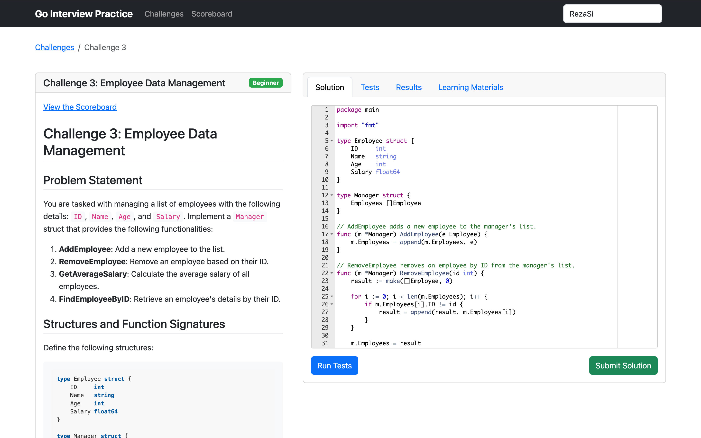
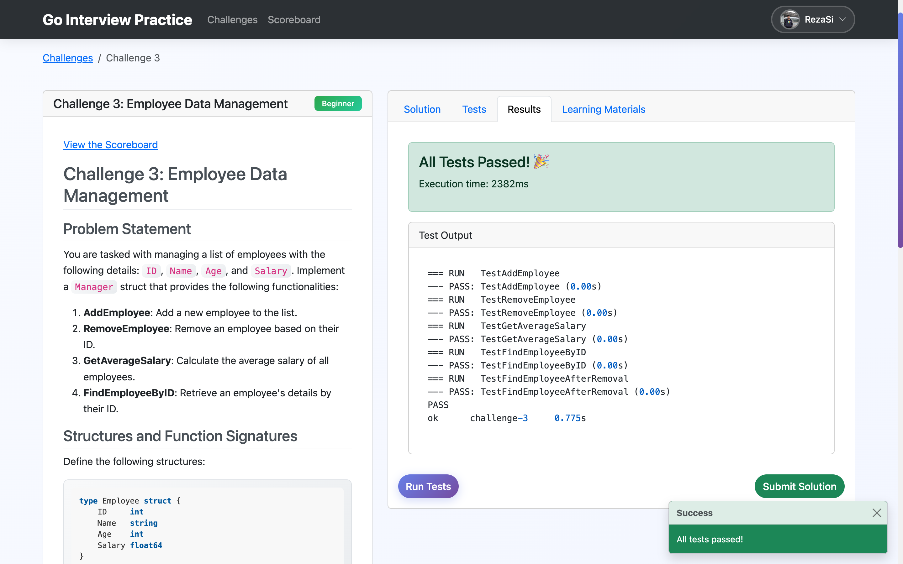
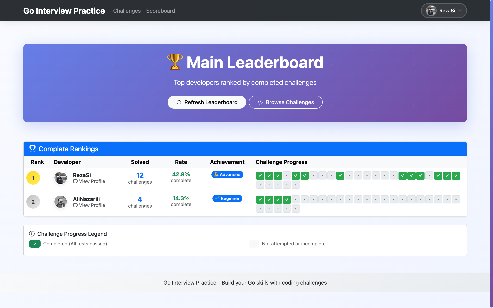
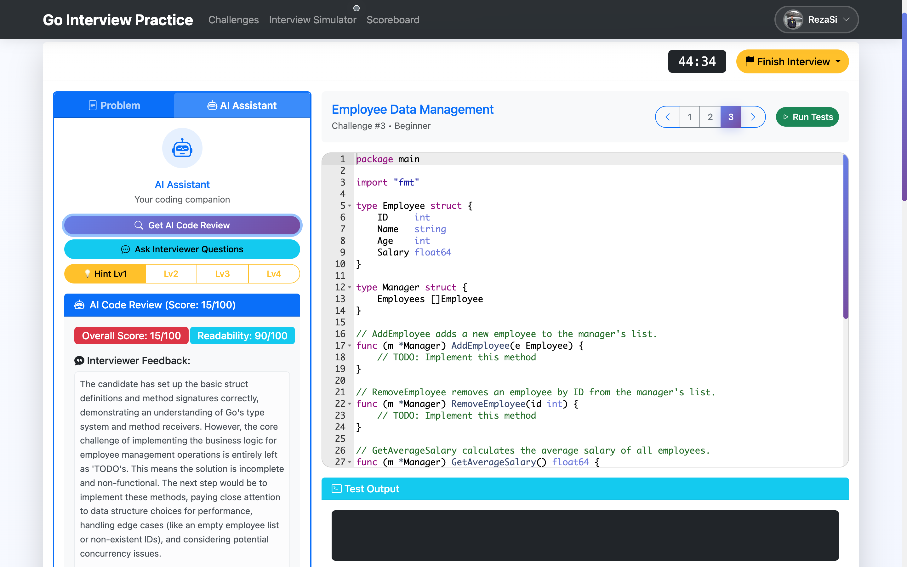
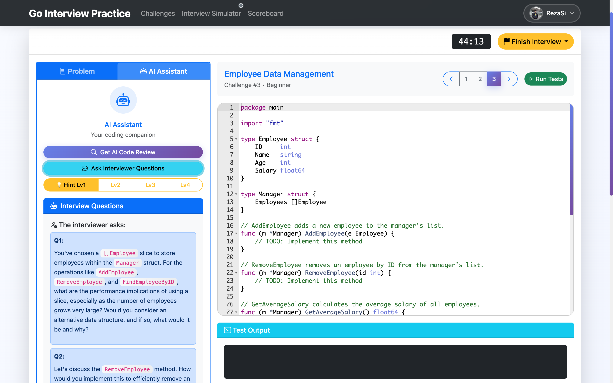

# Go Interview Practice

<div align="center">

[](https://github.com/RezaSi/go-interview-practice/stargazers)
[](https://golang.org/)
[](https://github.com/RezaSi/go-interview-practice)

<a href="https://trendshift.io/repositories/14255" target="_blank">

</a>

**⭐ Star the repo if it’s useful to you**
<br/>
<br/>
</div>


Welcome to the **Go Interview Practice** repository! Master Go programming and ace your technical interviews with our interactive coding challenges.

---

## Visual Overview

### Interactive Challenge Platform
Our comprehensive web interface provides everything you need to practice and master Go programming:


<div align="center">
  <video src="https://github.com/user-attachments/assets/23468aab-a032-4326-9d05-84de86c9128c" controls width="90%"></video>
  <p><em>A brief introduction to the project</em></p>
</div>

---

### Code & Test Experience

<div align="center">
  
  
</div>

<div align="center">
  <table>
    <tr>
      <td align="center" width="48%">
        <strong>Interactive Code Editor</strong><br>
        <em>Write, edit, and test your Go solutions<br>with syntax highlighting and real-time feedback</em>
      </td>
      <td width="4%"></td>
      <td align="center" width="48%">
        <strong>Instant Results & Analytics</strong><br>
        <em>Get immediate test results, performance metrics,<br>and detailed execution analysis</em>
      </td>
    </tr>
  </table>
</div>

---

### Competitive Leaderboard

<div align="center">
  
  <p><em>Beautiful leaderboard showcasing top developers with challenge completion indicators, rankings, and achievements</em></p>
</div>

---

## 🏆 Top 10 Leaderboard

Our most accomplished Go developers, ranked by number of challenges completed:

> **Note**: The data below is automatically updated by GitHub Actions when challenge scoreboards change.

| 🏅 | Developer | Solved | Rate | Achievement | Progress |
|:---:|:---:|:---:|:---:|:---:|:---|
| 🥇 | <br/>**[odelbos](https://github.com/odelbos)** | **29**/30 | **96.7%** | Master | ✅✅✅✅✅✅✅✅✅✅✅⬜✅✅✅<br/>✅✅✅✅✅✅✅✅✅✅✅✅✅✅✅ |
| 🥈 | <br/>**[mick4711](https://github.com/mick4711)** | **23**/30 | **76.7%** | Master | ✅✅✅✅✅✅✅✅✅✅⬜⬜✅✅⬜<br/>✅✅✅✅✅✅✅✅⬜⬜✅✅⬜⬜✅ |
| 🥉 | <br/>**[y1hao](https://github.com/y1hao)** | **21**/30 | **70.0%** | Master | ✅✅✅✅✅✅✅✅⬜✅⬜⬜✅✅⬜<br/>✅✅✅✅✅✅✅✅⬜⬜⬜✅⬜⬜✅ |
| 4 | <br/>**[Gandook](https://github.com/Gandook)** | **20**/30 | **66.7%** | Master | ✅✅✅✅⬜✅✅✅✅✅⬜⬜✅⬜⬜<br/>⬜✅✅✅⬜✅✅✅✅✅⬜✅⬜⬜✅ |
| 5 | <br/>**[JackDalberg](https://github.com/JackDalberg)** | **20**/30 | **66.7%** | Master | ✅✅✅✅✅✅✅✅⬜✅⬜⬜✅✅⬜<br/>⬜✅✅✅✅✅✅✅⬜⬜⬜✅⬜⬜✅ |
| 6 | <br/>**[PolinaSvet](https://github.com/PolinaSvet)** | **20**/30 | **66.7%** | Master | ✅✅✅✅✅✅✅⬜⬜✅⬜⬜✅✅⬜<br/>✅✅✅✅✅✅✅✅⬜⬜⬜✅⬜⬜✅ |
| 7 | <br/>**[ashwinipatankar](https://github.com/ashwinipatankar)** ❤️ | **18**/30 | **60.0%** | Expert | ✅✅✅⬜✅✅✅⬜✅✅⬜⬜✅✅⬜<br/>⬜✅✅✅⬜✅✅✅⬜⬜⬜✅⬜⬜✅ |
| 8 | <br/>**[KhaledMosaad](https://github.com/KhaledMosaad)** | **14**/30 | **46.7%** | Advanced | ✅✅✅⬜⬜✅⬜⬜⬜⬜⬜⬜✅⬜⬜<br/>⬜✅✅✅⬜✅✅✅⬜⬜✅✅⬜⬜✅ |
| 9 | <br/>**[RezaSi](https://github.com/RezaSi)** | **14**/30 | **46.7%** | Advanced | ✅✅✅✅✅✅⬜⬜⬜✅⬜⬜✅⬜⬜<br/>⬜✅✅✅⬜✅✅✅⬜⬜⬜⬜⬜⬜⬜ |
| 10 | <br/>**[MYK12397](https://github.com/MYK12397)** | **11**/30 | **36.7%** | Advanced | ⬜✅✅⬜✅✅✅⬜⬜⬜⬜⬜⬜⬜⬜<br/>⬜✅✅✅⬜✅⬜⬜✅⬜⬜⬜⬜⬜✅ |

<div align="center">

✅ Completed • ⬜ Not Completed

*All 30 challenges shown in two rows*

</div>

*Updated automatically based on 30 available challenges*

### Challenge Progress Overview

- **Total Challenges Available**: 30
- **Active Developers**: 92
- **Most Challenges Solved**: 29 by odelbos

<!-- END_CLASSIC_LEADERBOARD -->
## 🚀 Package Challenges Leaderboard

Master Go packages through hands-on challenges! Each package offers a structured learning path with real-world scenarios.

> **Note**: The data below is automatically updated by GitHub Actions when package challenge scoreboards change.

| 🏅 | Developer | Total Solved | Packages | Achievement | Challenge Distribution |
|:---:|:---:|:---:|:---:|:---:|:---|
| 🥇 | <br/>**[odelbos](https://github.com/odelbos)** | **17** | **4** pkgs | 🔥 Package Master | **cobra**: 4 • **fiber**: 4 • **gin**: 4 • **gorm**: 5 |
| 🥈 | <br/>**[RezaSi](https://github.com/RezaSi)** | **3** | **3** pkgs | 🚀 Package Intermediate | **cobra**: 1 • **gin**: 1 • **gorm**: 1 |
| 🥉 | <br/>**[ashwinipatankar](https://github.com/ashwinipatankar)** ❤️ | **3** | **1** pkg | 🚀 Package Intermediate | **cobra**: 3 |
| 4 | <br/>**[GleeN987](https://github.com/GleeN987)** | **1** | **1** pkg | 🌱 Package Beginner | **gin**: 1 |
| 5 | <br/>**[MarioPaez](https://github.com/MarioPaez)** | **1** | **1** pkg | 🌱 Package Beginner | **gin**: 1 |

<div align="center">

🚀 **Package Challenges** - Learn Go packages through practical, real-world scenarios

</div>

### 📦 Per-Package Progress

#### Cobra Package

| Rank | Developer | Completed | Progress |
|:---:|:---:|:---:|:---|
| 🥇 | **[odelbos](https://github.com/odelbos)** | 4/4 | 🟩🟩🟩🟩🟩🟩🟩🟩🟩🟩 100% |
| 🥈 | **[ashwinipatankar](https://github.com/ashwinipatankar)** | 3/4 | 🟩🟩🟩🟩🟩🟩🟩⬜⬜⬜ 75% |
| 🥉 | **[RezaSi](https://github.com/RezaSi)** | 1/4 | 🟩🟩⬜⬜⬜⬜⬜⬜⬜⬜ 25% |

#### Fiber Package

| Rank | Developer | Completed | Progress |
|:---:|:---:|:---:|:---|
| 🥇 | **[odelbos](https://github.com/odelbos)** | 4/4 | 🟩🟩🟩🟩🟩🟩🟩🟩🟩🟩 100% |

#### Gin Package

| Rank | Developer | Completed | Progress |
|:---:|:---:|:---:|:---|
| 🥇 | **[odelbos](https://github.com/odelbos)** | 4/4 | 🟩🟩🟩🟩🟩🟩🟩🟩🟩🟩 100% |
| 🥈 | **[GleeN987](https://github.com/GleeN987)** | 1/4 | 🟩🟩⬜⬜⬜⬜⬜⬜⬜⬜ 25% |
| 🥉 | **[MarioPaez](https://github.com/MarioPaez)** | 1/4 | 🟩🟩⬜⬜⬜⬜⬜⬜⬜⬜ 25% |
| 4 | **[RezaSi](https://github.com/RezaSi)** | 1/4 | 🟩🟩⬜⬜⬜⬜⬜⬜⬜⬜ 25% |

#### Gorm Package

| Rank | Developer | Completed | Progress |
|:---:|:---:|:---:|:---|
| 🥇 | **[odelbos](https://github.com/odelbos)** | 5/5 | 🟩🟩🟩🟩🟩🟩🟩🟩🟩🟩 100% |
| 🥈 | **[RezaSi](https://github.com/RezaSi)** | 1/5 | 🟩🟩⬜⬜⬜⬜⬜⬜⬜⬜ 20% |

### 📊 Package Challenge Statistics

- **Total Package Challenges Available**: 17
- **Active Package Learners**: 5
- **Available Packages**: 4 (cobra, fiber, gin, gorm)

- **Most Package Challenges Solved**: 17 by odelbos

<!-- END_PACKAGE_LEADERBOARD -->
## Key Features

- **Interactive Web UI** - Code, test, and submit solutions in your browser
- **Automated Testing** - Get immediate feedback on your solutions
- **Automated Scoreboards** - Solutions are automatically scored and ranked
- **Profile Badges** - Beautiful auto-updating badges for GitHub profiles, LinkedIn, and portfolios
- **Performance Analytics** - Track execution time and memory usage for your solutions
- **Comprehensive Learning** - Each challenge includes detailed explanations and resources
- **Progressive Difficulty** - From beginner to advanced Go concepts
- **AI Interview Simulation** - Practice with AI-powered code review and interviewer questions

## AI Interview Simulation

Transform your coding practice into realistic interview scenarios with our AI-powered features:

**Real-Time Code Review** - Get instant feedback on code quality, complexity analysis, and improvement suggestions

**Dynamic Interview Questions** - AI generates follow-up questions based on your solution approach

**Progressive Hints** - 4-level hint system from subtle nudges to detailed explanations

**Multi-LLM Support** - Works with Gemini (recommended), OpenAI, or Claude

Simply add your API key to experience interview-style feedback that adapts to your code and challenges you with realistic technical questions.

### AI Interview Experience

<div align="center">
  
  
</div>

<div align="center">
  <table>
    <tr>
      <td align="center" width="48%">
        <strong>AI Code Review</strong><br>
        <em>Get instant feedback on code quality, complexity analysis,<br>and improvement suggestions from AI</em>
      </td>
      <td align="center" width="48%">
        <strong>Dynamic Interview Questions</strong><br>
        <em>AI generates follow-up questions based on your<br>solution approach and coding patterns</em>
      </td>
    </tr>
  </table>
</div>

---

## Quick Start

> **Important**: You must fork this repository first before cloning, otherwise you won't be able to push your solutions or create pull requests!

### Option 1: Web UI (Recommended)

```bash
# 1. First, fork this repository on GitHub
#    Go to https://github.com/RezaSi/go-interview-practice
#    Click the "Fork" button in the top-right corner

# 2. Clone your forked repository (replace 'yourusername' with your GitHub username)
git clone https://github.com/yourusername/go-interview-practice.git
cd go-interview-practice

# 3. Start the web interface
cd web-ui
go run main.go

# 4. Open http://localhost:8080 in your browser

# 5. Optional: Enable AI Features (Recommended) 🤖
# Add your free Gemini API key to enable AI interview simulation
echo "AI_PROVIDER=gemini" > web-ui/.env
echo "GEMINI_API_KEY=your_actual_api_key_here" >> web-ui/.env
# Get your free API key: https://makersuite.google.com/app/apikey
# Note: .env files are automatically ignored by git for security
```

**After solving challenges and submitting solutions:**
- Your solutions will be automatically saved to your local repository
- Follow the provided Git commands to commit and push your changes
- Create a pull request to contribute your solutions back to the main project

### Option 2: GitHub Codespaces (Cloud Development + Web UI)

Want to get started instantly without setting up anything locally? Use GitHub Codespaces!

1. **Fork this repository** (if you haven't already)
2. **Open in Codespaces**: Click the green "Code" button on your forked repository, then select "Codespaces" tab
3. **Create Codespace**: Click "Create codespace on main"
4. **Start the Web UI**: Once the codespace loads, open a terminal and run:
   ```bash
   cd web-ui
   go run main.go
   ```
5. **Optional: Enable AI Features**: Add your Gemini API key:
   ```bash
   echo "AI_PROVIDER=gemini" > .env
   echo "GEMINI_API_KEY=your_actual_api_key_here" >> .env
   ```
6. **Access the Web UI**: Click on the "Ports" tab in the bottom panel, then click the "Open in Browser" button next to port 8080

**Benefits of using Codespaces:**
- No local setup required
- Pre-configured Go environment
- Full VS Code experience in the browser
- Automatic port forwarding for the web UI
- All dependencies pre-installed
- Works on any device with a browser

### Option 3: Command Line

```bash
# 1. Fork the repository first (see step 1 above)
# 2. Clone your fork and set up a challenge workspace
git clone https://github.com/yourusername/go-interview-practice.git
cd go-interview-practice
./create_submission.sh 1  # For challenge #1

# 3. Implement your solution in the editor of your choice

# 4. Run tests
cd challenge-1
./run_tests.sh
```

## Profile Badges for Contributors

Showcase your Go programming achievements with auto-updating profile badges for GitHub profiles, portfolios, and personal websites.

### Examples

[](https://github.com/RezaSi/go-interview-practice)

[](https://github.com/RezaSi/go-interview-practice)

### Quick Usage

```markdown
[](https://github.com/RezaSi/go-interview-practice)
```

After contributing solutions, your badges are automatically generated in [`badges/YOUR_USERNAME_badges.md`](badges/) with multiple formats ready to use.

**[Complete Badge Guide & Examples →](docs/profile-badges-guide.md)**

## Challenge Categories

### Beginner
Perfect for those new to Go or brushing up on fundamentals
- **[Challenge 1](./challenge-1)**: Sum of Two Numbers
- **[Challenge 2](./challenge-2)**: Reverse a String
- **[Challenge 3](./challenge-3)**: Employee Data Management
- **[Challenge 6](./challenge-6)**: Word Frequency Counter
- **[Challenge 18](./challenge-18)**: Temperature Converter
- **[Challenge 21](./challenge-21)**: Binary Search Implementation
- **[Challenge 22](./challenge-22)**: Greedy Coin Change

### Intermediate
For developers familiar with Go who want to deepen their knowledge
- **[Challenge 4](./challenge-4)**: Concurrent Graph BFS Queries
- **[Challenge 5](./challenge-5)**: HTTP Authentication Middleware
- **[Challenge 7](./challenge-7)**: Bank Account with Error Handling
- **[Challenge 10](./challenge-10)**: Polymorphic Shape Calculator
- **[Challenge 13](./challenge-13)**: SQL Database Operations
- **[Challenge 14](./challenge-14)**: Microservices with gRPC
- **[Challenge 16](./challenge-16)**: Performance Optimization
- **[Challenge 17](./challenge-17)**: Interactive Debugging Tutorial
- **[Challenge 19](./challenge-19)**: Slice Operations
- **[Challenge 20](./challenge-20)**: Circuit Breaker Pattern
- **[Challenge 23](./challenge-23)**: String Pattern Matching
- **[Challenge 27](./challenge-27)**: Go Generics Data Structures
- **[Challenge 30](./challenge-30)**: Context Management Implementation

### Advanced
Challenging problems that test mastery of Go and computer science concepts
- **[Challenge 8](./challenge-8)**: Chat Server with Channels
- **[Challenge 9](./challenge-9)**: RESTful Book Management API
- **[Challenge 11](./challenge-11)**: Concurrent Web Content Aggregator
- **[Challenge 12](./challenge-12)**: File Processing Pipeline
- **[Challenge 15](./challenge-15)**: OAuth2 Authentication
- **[Challenge 24](./challenge-24)**: Dynamic Programming - Longest Increasing Subsequence
- **[Challenge 25](./challenge-25)**: Graph Algorithms - Shortest Path
- **[Challenge 26](./challenge-26)**: Regular Expression Text Processor
- **[Challenge 28](./challenge-28)**: Cache Implementation with Multiple Eviction Policies
- **[Challenge 29](./challenge-29)**: Rate Limiter Implementation

## How to Use This Repository

### 1. Explore Challenges
Browse challenges through the web UI or in the code repository. Each challenge includes:
- Detailed problem statement
- Function signature to implement
- Comprehensive test cases
- Learning resources

### 2. Implement Your Solution
Write code that solves the challenge requirements and passes all test cases.

### 3. Test & Refine
Use the built-in testing tools to validate your solution, then refine it for:
- Correctness
- Efficiency
- Code quality

### 4. Submit & Compare
Submit your passing solution to be added to the scoreboard:
- Your solution is automatically tested and scored
- Execution time and resource usage are recorded
- Your solution is ranked among other submissions
- Access detailed performance metrics to optimize further

### 5. Learn & Progress
Review the learning materials to deepen your understanding of the concepts used.

## Contributing

We welcome contributions! You can contribute in several ways:

**Submit Solutions:**
- Solve existing classic or package challenges
- Submit your solutions via pull request

**Add New Challenges:**
- **Package Challenges:** Framework-specific practical applications (Gin, Cobra, GORM, etc.)

**Quick Steps:**
1. Fork the repository
2. Choose challenge type (classic or package-based)
3. Follow our template structure
4. Submit a pull request

See [CONTRIBUTING.md](CONTRIBUTING.md) for detailed guidelines on both challenge types.

## 🏢 Premium Business Sponsors

*Thank you to our premium sponsors who make this project possible!*

<!-- 
Premium sponsor logos will appear here when we have them. Format:
<div align="center">
<a href="https://company-website.com" target="_blank">

</a>
</div>
-->

*Interested in premium sponsorship? [Contact us](https://github.com/sponsors/RezaSi) to feature your company logo here and on our platform!*

---

## License

This project is licensed under the MIT License - see the [LICENSE](LICENSE) file for details.

## Stargazers over time
[](https://starchart.cc/RezaSi/go-interview-practice)

---

**Happy Coding!** 💻
